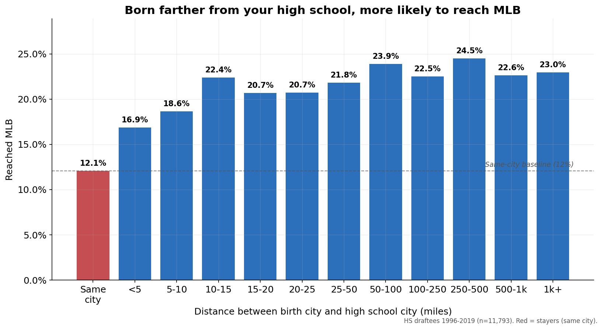

# Movers and Stayers: Geographic Mobility and Reaching the Major Leagues

Do MLB draftees who moved between where they were born and where they went to
high school reach the majors at higher rates than those who stayed in their
hometown? This project says yes, and argues the reason is **visibility**, not just
talent.

Analysis covers MLB draftees drafted out of high school, 1996–2019
(n = 11,921 players with a computable birth-to-high-school distance). This time period begins with the introduction of the 29th and 30th clubs into the Rule IV Draft, and goes through the last Draft before the 2020 rule changes.



## Headline findings

- **Movers reach MLB more often.** Players born more than five miles from their
  high-school city reach the majors **21.6%** of the time versus **12.5%** for
  same-hometown players (odds ratio 1.69 controlling for draft round, 1.93
  unadjusted; p ≈ 7e-23). Movers are also drafted about seven rounds earlier.

- **The cutoff is not cherry-picked.** The advantage holds at every distance
  threshold tested, from 1 mile to 100 miles (odds ratios 1.56–1.69).

- **It is a dose-response.** Reach rate rises with distance moved, not a simple
  on/off split. The underlying relationship is smooth; clustering finds no
  natural breakpoints.

- **Identical once they arrive.** Among players who reach MLB, movers and stayers
  are statistically indistinguishable on career value, per-chance rate stats, and
  longevity (10+ null tests, smallest p ≈ 0.33). Mobility predicts *arrival*, not
  quality.

- **Biggest where scouting is thinnest.** The effect grows in the later draft
  rounds (odds ratio 1.36 in rounds 1–5 rising to 2.53 in rounds 41+) and is
  strongest among players who were never re-drafted (no college pathway, so no
  confound) — exactly where being seen is least guaranteed.

- **A warning for bats, not arms.** Among reachers, per-chance value falls with
  distance for hitters (WAR/600 PA: 1.01 for stayers down to 0.56 for the
  farthest movers) but stays flat for pitchers (WAR/150 IP, ~0.96 throughout).
  Interpretation: velocity is measured objectively from anywhere, but hitting is
  projected subjectively, so a more-visible bat can be over-drafted on exposure.

**Practical read:** the mover signal reflects coverage, not ability. Equally good
"stayers" exist and are simply less seen — an argument for reallocating scouting
toward thinner regions and later rounds, and for treating the mover signal as a
caution flag specifically on hitters.

## Method (brief)

1. Parse birth city and high-school city from draft records.
2. Geocode both to coordinates (Nominatim on OpenStreetMap data, cached).
3. Compute great-circle distance between city centers; flag "movers" past a
   distance threshold.
4. Model reaching MLB as a function of mover status, controlling for draft round;
   test robustness across thresholds, draft-round bands, player pathways, and by
   position type.
5. Join career outcomes (WAR and rate stats) to compare movers and stayers among
   players who reached the majors.

## Reproducing this

The source data is **not included** in this repository (see below). To run the
pipeline you must obtain the underlying data yourself and place it under `data/`
as `tbc_draft_register.csv` and `tbc_signing_bonus.csv`.

```
pip install pandas numpy statsmodels matplotlib requests
# place obtained data files under ./data/
python scripts/run_all_hs.py
```

Scripts read from `data/` and write outputs to the working directory. Geocoding
respects the Nominatim usage policy (one request per second, cached; a proper
User-Agent is set).

## Data sources and acknowledgments

Draft, biographical, and birthplace data provided by **The Baseball Cube**, which
displays these records in a useful public format. A shout-out to TBC for the
service. Underlying records are **not redistributed** in this repository.

MLB career statistics and WAR (fWAR) provided by FanGraphs, with thanks. Their data is not redistributed here.

Geocoding via the **Nominatim** API on **OpenStreetMap** data. Location data
© OpenStreetMap contributors, ODbL 1.0.

## Data not included

This repository contains **code only**. The draft/bio data (The Baseball Cube)
and the career statistics (FanGraphs) are used under terms that do not permit
redistribution, so no raw data, cached geocodes, or derived player-level files
are committed here. Anyone wishing to reproduce the analysis should obtain the
data directly from those providers.

- The Baseball Cube: [https://www.thebaseballcube.com](https://www.thebaseballcube.com/content/about/data.asp#draft)
- FanGraphs: https://www.fangraphs.com
- Nominatim: https://nominatim.org · OpenStreetMap: https://www.openstreetmap.org

## Disclaimer

Analysis and views are my own. Based entirely on publicly available and licensed
data.
